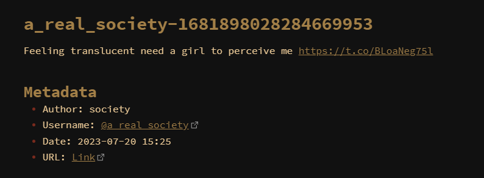

# Convert tweets exported from twitter-web-exporter to .MD files for Obsidian

This currently is tested for bookmarks page.
Many thanks to contributers of twitter-web-exporter <3

## Output

## Requirements
- JSON file from [twitter-web-exporter](https://github.com/prinsss/twitter-web-exporter) containing bookmarked tweets (no need to check 'include all metadata'). You can get this from Export Data option.
- Python

## Usage
In CMD enter:
`python script.py path\to\JSON`

## To do/may do
- threads??
- likes??
- maybe turn into a plugin??
